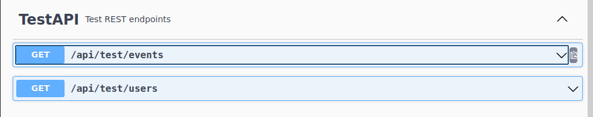

# Oxalate Portal backend service

If you're looking for installation or management documentation, see the [documentation](documentation/index.md) folder.

## Structure

The project is a multimodule project where we've separated the REST API to [`api`](api/) module, while the server code is in [`service`](service/) module.

## Application documentation

The application functionality documentation can be found in the [documentation](documentation/index.md) folder.

## Development

### Module/library versions

We use [maven-enforcer-plugin](https://maven.apache.org/enforcer/maven-enforcer-plugin/usage.html) to ensure we're not importing multiple versions of the same
module or library to the build. To activate the enforcer-plugin, run the `verify` stage, like so:

```shell
./mvnw clean verify
```

This will fail, with details, if there are multiple versions of the same module.

### OpenAPI Swagger UI

[LOCAL](http://localhost:8081/actuator/swagger-ui/index.html)

Most of the endpoints require that you authenticate yourself first. Click on the `Authorize` button located in the upper right corner.

### Running the service

First you need to create the main directory where the service will store the uploaded files. Set it e.g. to `/var/tmp/oxalate`. You can change this location by
setting the `oxalate.file.upload-dir` property in the appropriate value. Once the service starts up, it will check the existence of this directory as well as
create the necessary subdirectories if they're missing.

The service can be run locally by starting the PostgreSQL server with the script [`db_local_setup.sh`](db_local_setup.sh). The script will clean up any previous
docker container and volume, so you always have a fresh, empty database available.

When the database is up and running, you can start up the service itself with the command:

```shell
./mvnw clean test spring-boot:run \
-Dspring-boot.run.jvmArguments='-Dspring.profiles.active=local -Dlogging.level.io.oxalate=debug \
  -Doxalate.first-time=false -Doxalate.upload.directory=/var/tmp/oxalate'
```

This will generate the necessary schema and tables. Once the service is up and running, you can complete the setup by running
[`create_local_users.sh`](./create_local_users.sh). This will use the [`test.sql`](test-data/test.sql) which injects a couple of users as well as a some events
in the future into the database so that the local installation can be logged onto and tested manually. The user details are in the file.

Alternatively you can use a larger dataset, located in [`test-large.sql`](test-data/test-large.sql) which contains several thousand users and hundreds of
events. This dataset has been generated with the test facility which is only available when running the service locally. To use the large dataset, you run the
command as follows:

```shell
cat test-data/test-large.sql | psql --host=localhost --port=5432 --username oxalate oxdb
```

Once the above are up and running, you can start the [frontend](https://github.com/oxalateportal/oxalate-frontend) locally. See
the [README.md](https://github.com/oxalateportal/oxalate-frontend/blob/master/README.md) for details.

The file contains also some pre-generated audit events which have been generated with the following command:

```shell
for i in $(seq 1 60); do
    echo "('$(uuidgen)','INFO',$((1 + $RANDOM % 100)), '1.2.3.4', 'TestController','Test message',NOW()-INTERVAL '$((1 + $RANDOM % 40)) DAYS'),"
done
```

After which some of the INFO-level messages were changed to ERROR- and WARN-level messages.

The local setup is simple, we use a default PostgreSQL instance with `oxalate`-user and password set to `oxalate_password`. The schema is `oxalate`. These
settings should be set in the [local.yaml](service/src/main/resources/local.yaml). There is a template file available in the [template directory](templates/).

All the events are either in the future, or the past. If you need to test with an ongoing event (using the large dataset), run the following command:

```sql
UPDATE events
SET event_duration = 12,
    start_time     = NOW() - INTERVAL '1 hour'
WHERE id IN (7, 8, 9);
```

#### Test API

When running the service locally, an additional REST API is available in Swagger UI.



The `/api/test/users` takes a single parameter, `numberOfUsers` and then generates that many users into the database.

The `/api/test/events` takes a single parameter, `numberOfYears` and then generates that events, users and payments into the database for given number of years.
Note that this process may not be very fast, generating 5 years of activity will take around 10 minutes. If you need larger number of events, then consider
using the data in [`test-large.sql`](test-data/test-large.sql) instead.

With the large dataset, every user has the same password, `aA1^WWWWWWWWW`. Some more useful users are:

| Username                     | Password      | Role                   |
|------------------------------|---------------|------------------------|
| phoenix.thompson@example.com | aA1^WWWWWWWWW | USER, ORGANIZER, ADMIN |
| julie.chevalier@example.com  | aA1^WWWWWWWWW | USER, ADMIN            |
| sean.brewer@example.com      | aA1^WWWWWWWWW | USER, ORGANIZER        |
| tilda.richardsen@example.com | aA1^WWWWWWWWW | USER, ORGANIZER        |
| perelyub.loboda@example.com  | aA1^WWWWWWWWW | USER                   |

### Local SMTP configuration

By default, mail sending (SMTP) is not enabled on local environment. In this case emails sent by system are logged on `INFO` level.

It is also possible to set up local mail server, for example by starting a catch-all server container with following command:

```
docker run --rm -it -p 3001:80 -p 2525:25 rnwood/smtp4dev:v3
```

In addition to that change `oxalate.mail.enabled` variable to `true` in `local.yaml` config file.

## Codestyle and conventions

See [CODESTYLE.md](documentation/CODESTYLE.md) and [CONVENTIONS.md](documentation/CONVENTIONS.md)

## GitHub Actions (GHA)

GHA has been enabled in the repository. Current version is very rudimentary, it merely checks out the code, and runs the small set of existing tests.
Nonetheless, it is a good start, and it can be extended to run more tests, and to build the docker image.

GHA is configured to run on every pull request. The build has to be green in order that the PR can be merged.

## Dependabot

Dependabot is enabled for this repository. It will automatically create pull requests to update dependencies when new versions of maven dependency modules
are released. The pull requests are created to the `dependabot` branch, and they need to be merged manually. The pull requests are created automatically
when new versions are released. The scheduling of dependabot is on weekly basis.

Each pull request should be investigated locally, and any additional commits should be annotated with `[dependabot]`-prefix.

# Licence

This code is published under the [GPL 2 License](LICENSE).

# Contributors

* Mikko Mustonen, founder, (Frontend, Backend)
* Paul-Erik 'Poltsi' Törrönen, developer, (Frontend, Backend)
